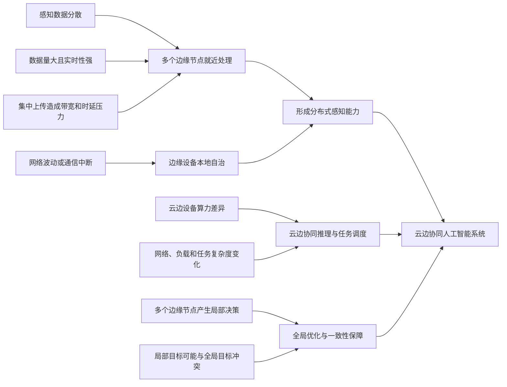
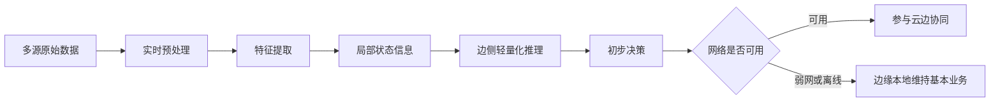
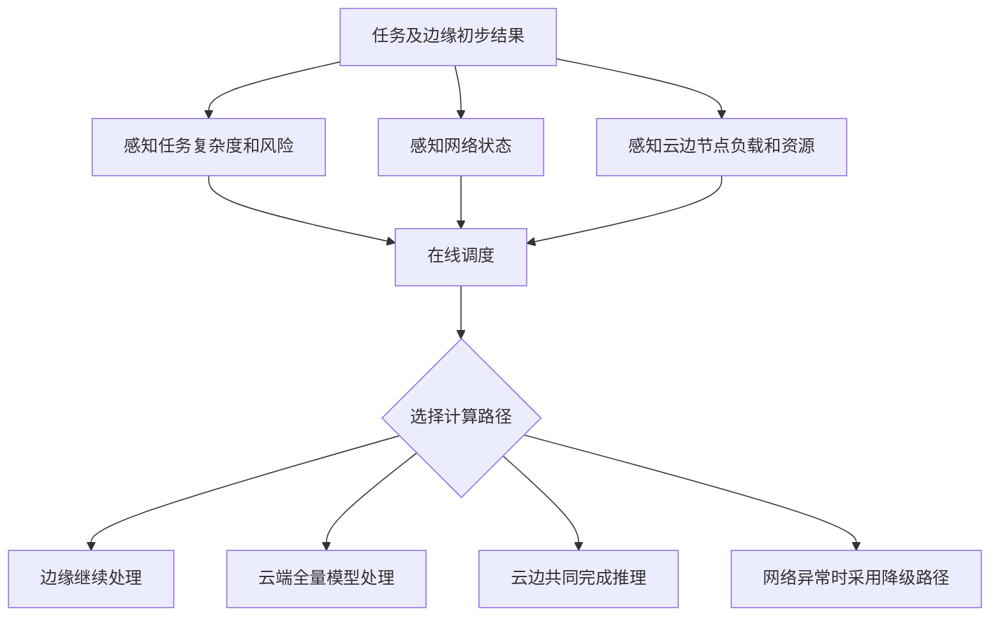
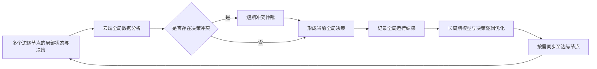
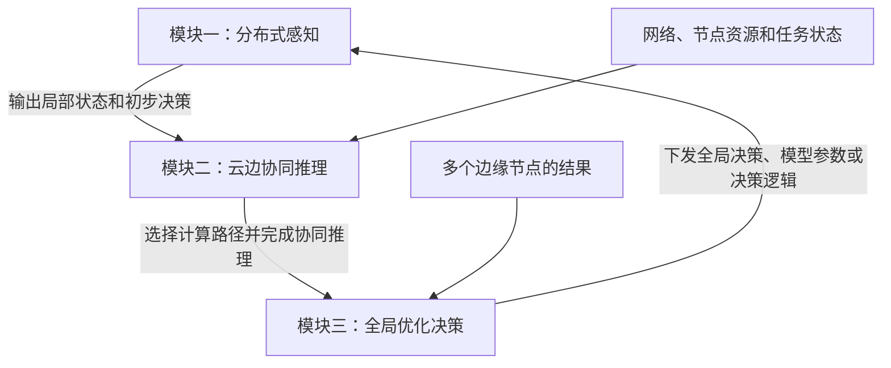

# XH-202606 云边协同赛题要求系统化理解

> 题目：面向云边协同场景的分布式人工智能感知与决策关键技术研究  
> 文档目的：按照赛题要求，对建设背景、三个任务模块、硬性指标及量化评价方式进行系统化整理。  
> 说明：本文重点解释“赛题要求我们做什么”，暂不展开具体算法和工程实现。

---

## 一、术语的人话解释

### 1. 指标

**指标就是系统必须满足的硬性要求。**

例如：

- 边侧轻量大模型单次推理内存占用不超过 `1.5 GB`；
- 网络波动期间基本业务功能保持率不低于 `90%`；
- 两类场景中的平均端到端时延不超过 `0.2 s`；
- 多边缘节点决策冲突比例不超过 `5%`。

没有达到这些规定数值，就不能说明系统满足赛题的核心要求。

### 2. 量化

**量化就是从哪些方面、使用哪些数字，评价系统做得好不好。**

例如：

- 用准确率、召回率和 F1 值评价感知效果；
- 用端到端时延评价实时性；
- 用数据上传量和带宽占用评价通信效率；
- 用冲突次数和一致性达成比例评价决策一致性。

赛题中并非所有量化项目都有规定的合格数值。例如，赛题建议使用准确率、召回率、F1 值等评价系统，但没有规定 F1 值必须达到多少。


---

## 二、为什么要做这个系统

### 1. 传统集中式云端模式面临的问题

在工业制造、智慧城市和能源基础设施等场景中，大量传感器、摄像头和终端设备持续产生数据。这些数据具有四个明显特点：

1. **数据产生位置分散。**  
   数据来自不同设备、不同区域和不同边缘节点，单个节点只能看到局部情况。

2. **数据量大且持续产生。**  
   如果所有原始数据都上传云端，会占用大量网络带宽，并增加云端计算压力。

3. **业务实时性要求高。**  
   工业故障检测、交通管理和能源监控等任务通常需要快速响应。数据经过网络上传到云端再返回结果，可能产生较大的传输时延。

4. **网络并不始终可靠。**  
   网络可能出现带宽下降、时延升高、丢包甚至通信中断。如果系统完全依赖云端，网络异常时现场业务可能无法继续运行。

因此，单纯依靠集中式云端处理，难以同时满足实时性、业务连续性和资源效率要求。

### 2. 为什么需要边缘处理

为了减少数据上传和等待时间，需要在数据产生位置附近部署边缘设备，让边缘侧先完成实时预处理、特征提取、轻量化推理和初步决策。

边缘处理的主要作用是：

- 就近处理数据，降低响应时延；
- 过滤或压缩原始数据，减少上传量；
- 在弱网或离线环境下继续维持基本业务；
- 对明显异常进行快速判断和及时响应。

网络波动时，依靠的不是单独一个“边缘模型”，而是边缘设备的本地自治能力，其中可以包括本地模型、本地规则、数据缓存和安全保护机制。

### 3. 为什么需要云端

边缘节点距离数据源近、响应快，但单个边缘节点的算力、存储能力和观察范围有限，只能掌握局部信息。

云端具有更强的计算和存储能力，可以汇聚多个边缘节点的数据与决策，完成：

- 多节点、多区域信息的综合分析；
- 复杂任务的高精度推理；
- 跨设备、跨区域的风险判断；
- 全局决策优化；
- 模型、参数或决策逻辑的长期更新。

### 4. 为什么需要云边协同

边缘设备和云端服务器的算力差异明显，而且网络状态、节点负载和任务难度会不断变化，因此不能让所有任务始终固定在边缘或云端执行。

云边协同系统需要解决两个核心问题：

1. **算力和任务如何合理分配。**  
   系统需要根据网络状态、任务复杂度和节点负载，为任务选择合适的计算路径。

2. **多个局部决策如何形成全局协调。**  
   多个边缘节点可能针对重叠感知区域或关联任务作出不同甚至冲突的决策，需要利用云端的全局分析能力进行协调。

### 5. 建设逻辑总结



### 6. 边缘、云端与云边协同的总体分工

| 部分 | 主要职责 | 人话解释 |
|---|---|---|
| 边缘 | 实时感知、轻量推理、初步决策、弱网自治 | 在现场先快速判断发生了什么，并维持基本业务 |
| 云端 | 全局数据分析、复杂推理、全局优化、长期更新 | 综合多个节点和历史信息，判断整个系统应该怎么做 |
| 云边协同 | 协同推理、任务调度、信息交互、决策协调 | 决定任务如何由云和边共同完成，并处理局部与全局之间的矛盾 |


---

## 三、任务模块一：分布式感知

> 这一模块主要对应边缘侧的职责。

### 1. 面临的问题

感知数据分散在多个设备和区域，并且具有较强的实时性。若所有原始数据全部上传云端处理，会增加传输时延和带宽压力；网络异常时，系统还可能失去基本业务能力。

因此，需要利用多个边缘节点就近处理数据，形成分布式感知能力。

### 2. 模块目标

边缘侧需要做到两个方面：

1. 实时感知；
2. 轻量化推理。

### 3. 建设内容

#### 3.1 实时感知

实时感知主要面向视频流、传感器数据等多源异构数据，相关处理不一定由大语言模型完成。

需要具备以下能力：

1. 能够处理多源异构数据；
2. 能够完成实时预处理与特征提取，将原始数据转换为可以理解的状态信息；
3. 能够在离线或弱网环境下保持基本可用。

“多源异构数据”是指来源、格式和含义不同的数据，例如振动波形、温度、电流、图像和设备日志。

#### 3.2 轻量化推理

赛题要求基于国产开源全量大模型，例如 DeepSeek，压缩构建可以在边侧信创环境流畅部署的轻量大模型。

轻量化推理需要具备以下能力：

1. 通过全量大模型压缩获得边侧轻量大模型；
2. 根据感知结果，对局部态势作出初步决策。

当前对这一部分的理解是：

- 实时感知可由适合传感器或视频数据的专业模型完成；
- 轻量大模型可根据感知得到的状态信息进行综合理解和初步决策。

> 说明：“专业感知模型 + 轻量大模型”是当前对技术实现方式的理解，不是赛题原文明确规定的唯一结构。

### 4. 硬性指标

| 指标 | 赛题要求 | 说明 |
|---|---:|---|
| 能力保持 | 全量大模型能力的 `80%～90%` | 指数学、代码、自然语言推理等任务 |
| TTFT | 减少 `75%` | 需要明确与压缩前全量模型等基准进行比较 |
| 单次推理内存 | `≤1.5 GB` | 指边侧轻量大模型单次推理的内存占用 |
| 局部感知与初步决策 | 毫秒级 | 原文未给出具体毫秒数，需要在实验中自行明确测量口径 |

TTFT（Time To First Token）是从发出请求到收到大模型生成的第一个 Token 之间的时间，用于衡量大模型第一次响应的速度。

“毫秒级感知与初步决策”应理解为从边缘侧接收到数据，到输出局部状态和初步决策的整体响应达到毫秒量级，而不只是预处理或特征提取中的某一个步骤。

### 5. 量化评估

| 评价方面 | 可使用的量化数据 |
|---|---|
| 感知精度 | 准确率、召回率、F1 值 |
| 决策效果 | 决策准确率、任务收益、任务完成效果 |
| 实时性能 | 预处理时延、特征提取时延、推理时延、整体局部响应时延 |
| 边侧资源 | 单次推理内存、CPU/GPU/NPU 使用率 |
| 弱网可用性 | 弱网或离线时成功处理的任务比例 |

### 6. 模块处理过程



---

## 四、任务模块二：云边协同推理

> 这一模块主要解决云端与边缘侧如何共同完成推理，以及任务如何调度。

### 1. 面临的问题

云端服务器与边缘设备之间的算力差距较大，同时网络状态、节点负载和任务复杂度会动态变化。

例如：

- 云端算力强，但依赖网络，传输时间和资源成本较高；
- 边缘响应快，但算力和内存有限；
- 系统任务量可能突然增加，形成非平稳负载；
- 网络可能出现时延升高、丢包或中断；
- 不同任务的难度、风险和实时性要求不同。

因此，系统需要合理分配云边计算资源，并动态调整任务的执行方式。

### 2. 模块目标

这一模块需要解决两个问题：

1. 云边协同推理；
2. 任务调度。

### 3. 建设内容

#### 3.1 云边协同推理

需要具备以下能力：

1. 构建边缘轻量模型与云端全量大模型互补、交互和协同的推理框架；
2. 对网络波动和任务复杂度进行多维感知；
3. 感知非平稳负载、网络异常等不确定性，并及时调整策略；
4. 在保障推理准确性的同时，降低时间和资源成本。

这里的“交互和协同”可能意味着云端和边缘共同完成一次推理，而不只是简单选择任务在云端或边缘执行。

云端和边缘之间可能交换局部推理结果、置信度、任务上下文、中间特征或云端复核结果。具体交互方式需要在后续技术方案中确定。

#### 3.2 任务调度

任务调度是调度器及调度算法的职责。

调度器需要了解（即云边协同推理中第二点第三点，多维感知，不确定性）：

| 任务方面 | 系统方面 |
|---|---|
| 任务难不难 | 网络状态怎么样 |
| 任务急不急 | 边缘节点忙不忙 |
| 任务风险高不高 | 云端是否可用 |
| 数据量大不大 | 节点资源是否充足 |

在此基础上，通过在线调度机制，为任务动态寻找最佳计算路径。

“最佳”不是只追求某一个目标，而是在准确性、时延、通信成本和计算资源之间进行综合权衡。

### 4. 硬性指标

| 指标 | 赛题要求 | 说明 |
|---|---:|---|
| 弱网基本业务功能保持率 | `≥90%` | 网络波动期间，基本业务仍能完成的比例 |

“基本业务功能”需要结合具体场景定义。例如，在轴承场景中可以包括继续采集数据、识别明显异常、触发必要告警和缓存尚未上传的数据。

### 5. 量化评估

| 评价方面 | 可使用的量化数据 |
|---|---|
| 实时性 | 端到端响应时延、处理时延、相对基准的时延降低比例 |
| 通信效率 | 数据上传量、带宽占用、上传比例 |
| 资源效率 | 云端和边缘计算资源使用率、内存占用、云端负载变化 |
| 调度效果 | 各计算路径任务数、调度成功率、策略切换次数 |
| 弱网运行效果 | 基本业务功能保持率、任务成功率、性能波动范围 |

赛题特别要求通过实验或仿真，与集中式云端方案、单边缘方案等基准方案进行对比，而不是只展示本系统自身的数值。

### 6. 模块处理过程

这里注意，边缘提供的是边缘额初步结果；网络状态、节点负载、任务复杂度等，需要专门的组件来检测，并将信息提供给调度器



---

## 五、任务模块三：全局优化决策

> 这一模块主要对应云端的全局分析、长期优化和一致性保障职责。

### 1. 面临的问题

分布式感知系统包含多个边缘节点。各边缘节点依据自身掌握的局部数据作出判断，可能出现：

- 不同节点针对重叠感知区域得出不同结论；
- 多个关联任务之间产生相互冲突的决策；
- 边缘节点只追求局部收益，影响系统整体目标；
- 不同节点使用的模型参数或决策逻辑不一致。

因此，需要利用云端的跨域认知和全局数据分析能力，协调局部决策与系统全局目标之间的关系。

### 2. 模块目标

这一模块需要解决两个问题：

1. 全局决策优化；
2. 一致性保障。

### 3. 建设内容

#### 3.1 全局决策优化

依托云端全量大模型的跨域认知能力，构建模型分发与更新机制。

云端可以根据全局数据进行长周期分析和优化，并根据不同边缘节点的实际需要，同步：

- 更新后的模型；
- 部分模型参数；
- 决策逻辑；
- 规则、阈值或策略。

“按需同步”意味着不一定每次都向所有边缘节点下发完整模型，也可以只同步某些节点需要的参数或决策逻辑。

#### 3.2 一致性保障

通过云端全局数据分析，制定长周期模型优化更新机制，并将更新后的模型参数或决策逻辑同步至边缘侧，从长期上减少边缘局部贪婪决策与系统全局最优目标之间的冲突。

当前对一致性保障的理解可以分成两个时间尺度：

| 时间尺度 | 作用 |
|---|---|
| 短期 | 当多个边缘节点已经产生冲突时，采用临时仲裁方案解决当前冲突 |
| 长期 | 利用云端全局分析结果，更新并分发模型参数或决策逻辑，降低以后再次发生冲突的概率 |

> 说明：赛题明确要求统计冲突解决成功率，但没有规定具体的临时仲裁方法。临时仲裁机制属于后续需要自行设计的技术内容。

### 4. 硬性指标

这些指标适用于存在重叠感知区域或关联任务的多个边缘节点：

| 指标 | 赛题要求 |
|---|---:|
| 决策冲突比例 | `≤5%` |
| 冲突解决成功率 | `≥90%` |

赛题并不是要求所有边缘节点在所有情况下输出完全相同的结果，而是要求在多个节点处理重叠区域或关联任务时，控制冲突比例并有效解决已经发生的冲突。

### 5. 量化评估

| 评价方面 | 可使用的量化数据 |
|---|---|
| 稳定性 | 任务成功率、系统可用性、网络波动下的性能变化范围 |
| 节点差异适应性 | 不同算力、负载或模型版本节点下的运行表现 |
| 决策一致性 | 冲突次数、冲突比例、一致性达成比例、决策偏差 |
| 冲突处理 | 冲突解决成功率、冲突处理时延 |
| 长期优化效果 | 更新前后冲突率、决策效果或任务收益的变化 |

### 6. 模块处理过程



---

## 六、方案完整性与可扩展性

> 这一部分不是独立的业务任务，而是对整个云边协同方案进行验收。

### 1. 场景硬性指标

| 指标 | 赛题要求 |
|---|---:|
| 场景数量 | 至少两类差异明显的场景 |
| 平均端到端时延 | `≤0.2 s` |

“两类差异明显的场景”不能只是在同一场景中更换一组数据，而应在实时性、数据类型、覆盖范围、节点规模或协同方式等方面存在明显差异。

赛题允许通过仿真、实验或原型系统等方式进行验证，不一定要求在两个真实生产环境中完成落地部署。

端到端时延：从一个任务开始，到系统给出最终结果，整个过程总共花了多长时间。

### 2. 当前初步场景：轴承检测

当前初步选择轴承检测这一工业场景，希望通过：

```text
边缘快速感知和初步判断
            +
云端多节点、历史数据和全局信息分析
            ↓
生产过程智能优化与风险预警
```

在继续深化场景前，需要明确“轴承检测”的现实目的，因为现实需求会直接决定系统的输入数据和最终输出。

轴承场景可能存在两种不同方向：

| 场景方向 | 现实目的 | 典型输出 |
|---|---|---|
| 设备轴承状态监测 | 判断生产设备中的轴承是否发生磨损或故障，避免设备意外停机 | 正常/异常、故障类型、风险等级、是否告警、是否维修或停机 |
| 轴承产品质量检测 | 判断生产出来的轴承产品是否合格，发现生产工艺问题 | 合格/不合格、缺陷类型、是否剔除、是否调整工艺 |

结合当前项目已有的振动、温度、电流、转速和负载数据，现阶段更接近“设备轴承状态监测”。最终选择仍需要团队结合现实需求确认。

### 3. 方案完整性的量化或说明

完整方案应覆盖以下完整链路：


### 4. 可扩展性的量化或说明

可扩展性是指系统在节点规模或应用场景发生变化时，仍然能够适应，而不需要整体推倒重做。

可以从以下方面进行定性说明或简单量化：

| 变化类型 | 需要说明或测试的内容 |
|---|---|
| 节点规模变化 | 从少量边缘节点增加到多个节点后，时延、成功率和资源占用如何变化 |
| 任务负载变化 | 任务数量增加或突然波动时，系统性能是否稳定 |
| 网络状态变化 | 网络稳定、弱网、丢包或中断时，系统是否能够调整策略 |
| 应用场景变化 | 更换数据类型和业务模型后，云边协同机制能否继续复用 |

---

## 七、三个任务模块的关系



| 模块 | 主要位置 | 主要解决的问题 | 核心结果 |
|---|---|---|---|
| 分布式感知 | 边缘侧 | 数据分散、实时性强、弱网可用 | 局部状态与初步决策 |
| 云边协同推理 | 云边之间 | 算力异构、网络变化、任务复杂度和负载变化 | 合适的计算路径和协同推理结果 |
| 全局优化决策 | 云端为主 | 局部决策冲突、局部目标与全局目标不一致 | 全局决策及长期更新策略 |

---

## 八、赛题硬性指标总表

| 所属部分 | 硬性指标 |
|---|---:|
| 边侧轻量大模型能力 | 保持全量大模型能力的 `80%～90%` |
| 边侧轻量大模型 TTFT | 减少 `75%` |
| 边侧单次推理内存 | `≤1.5 GB` |
| 边缘局部感知与初步决策 | 达到毫秒级，原文未规定具体毫秒数 |
| 弱网基本业务功能保持率 | `≥90%` |
| 验证场景 | 至少两类差异明显的场景 |
| 平均端到端时延 | `≤0.2 s` |
| 多节点决策冲突比例 | `≤5%` |
| 冲突解决成功率 | `≥90%` |

---

## 九、赛题量化评价总表

| 评分方面 | 分值 | 主要评价内容 | 参考量化数据 |
|---|---:|---|---|
| 实时性改进 | 15 | 相比集中式或单边缘基准的时延改进 | 端到端时延、处理时延、相对降低比例 |
| 感知与决策效果 | 15 | 感知精度、决策准确性和任务效果 | 准确率、召回率、F1 值、任务收益 |
| 资源与通信效率 | 10 | 边缘处理对云端负载和通信压力的缓解 | 数据上传量、带宽占用、资源使用率 |
| 方案完整性 | 15 | 是否形成完整且结构清晰的云边协同方案 | 完整链路和功能覆盖情况 |
| 可扩展性与适应性 | 10 | 节点规模或场景变化时的适应能力 | 定性说明或简单量化结果 |
| 稳定性表现 | 10 | 网络波动、节点差异下的运行表现 | 成功率、可用性、性能波动范围 |
| 决策一致性 | 10 | 多节点或多决策单元的一致性 | 冲突次数、一致性比例、决策偏差 |
| 创新性 | 10 | 是否提出有创新性的云边协同方法或机制 | 与基准方法的差异和优势 |
| 应用价值 | 5 | 应用可行性和推广潜力 | 场景需求、实际收益、推广范围 |

> 总分为 100 分。前三项共同构成“云边协同技术效果”40分。

---

## 十、当前仍需进一步明确的问题

以下问题不是对本文架构的修改，而是后续理解赛题和确定场景时需要继续讨论的内容：

1. 轴承检测最终选择“设备状态监测”还是“轴承产品质量检测”；
2. 轻量大模型在轴承场景中具体负责什么，为什么必须使用大模型；
3. “基本业务功能”在轴承场景中具体包括哪些功能；
4. 云端模型与边缘模型如何共同完成一次推理；
5. “最佳计算路径”具体要综合优化哪些目标；
6. 短期冲突仲裁采用什么判断依据；
7. 第二类差异明显的验证场景选择什么；
8. 各项指标采用什么数据集、基准方案和统一测量方法。

---

## 十一、总体理解

这个赛题要构建的不是一个单独的边缘模型、云端模型或调度算法，而是一套完整的云边协同人工智能系统：

> 通过边缘侧实现分布式实时感知、轻量化推理和弱网自治；通过云边协同推理与在线任务调度，解决异构算力和动态环境下的计算分工问题；通过云端全局分析、冲突协调和长期模型更新，解决局部决策与全局目标之间的矛盾，最终使系统从多个相互独立的“单点智能”发展为能够协同工作的“全局智能”。


## 十二、后续的工作方向

1. 轴承检测最终的任务目的是什么
2. 边缘计算，初步预处理，预处理的结果，特征提取，特征提取的结果
3. 边缘模型，压缩是肯定的了，部署之后，是否微调？感觉大概率要微调，然后输出什么决策结果
4. 调度器接收什么数据，需要边缘模型提供什么决策结果。专门的网络波动检测数据，节点负载数据
5. 云端模型的全局分析，具体是全局分析什么？分析数据和初步处理结果吗，那分析之后给出什么？
6. 云端模型如何实现自更新与分发机制？这是可能实现的吗
7. 云端模型如何去分发更新边缘模型？